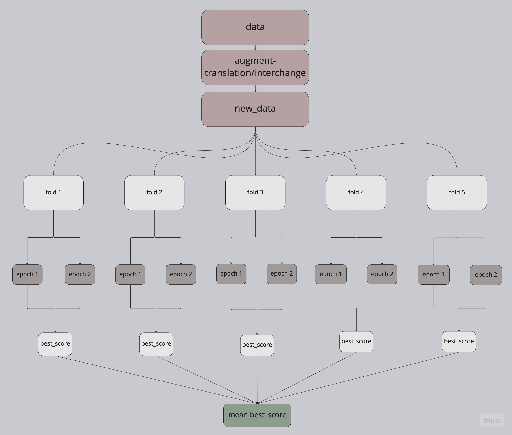

# Contradictory sentence classification

### Data
This project classifies pair of textual data into entailment, contradiction, or neutral. data are in 15 different languages.
[more deatails on the data](https://www.kaggle.com/competitions/contradictory-my-dear-watson)

### Architecture
- This is neural network based implementation on pytorch, where multiple pretrained hugging face models are tuned and optimized on a variety of hyperparameters.

- #### Augmentation   
    - Further, data augmentation is performed using the [M2M100](https://huggingface.co/facebook/m2m100_418M) a multilingual encoder-decoder (seq-to-seq) model trained for many-to-many multilingual translation. from hugging face. [~more on augmentation](https://www.kaggle.com/datasets/blessontomjoseph/contradictory-my-dear-watsonmore-data?select=en_to_bg.cs)

- #### Models used for classification
    - [xlm-roberta-base](https://huggingface.co/xlm-roberta-base) 
    - [bert-base-multilingual-cased](https://huggingface.co/bert-base-multilingual-cased)
    - [sentence-transformers/paraphrase-MiniLM-L6-v2](https://huggingface.co/sentence-transformers/paraphrase-MiniLM-L6-v2)

- #### Optimization: 
    - the scoring used is f1 score
    - the hyperparams are optimized on optuna with the objective of maximizing the mean best f1_score

- suff optimized and selected:
    - model 
    - learning rate
    - traing batch size
    - validation batch size
    - dropout probability
    - weight decay
    - optimization algorithm
    - momentum

- #### Training
    - the entire data is trained on the best found parameters
    - model saved on the model directory

